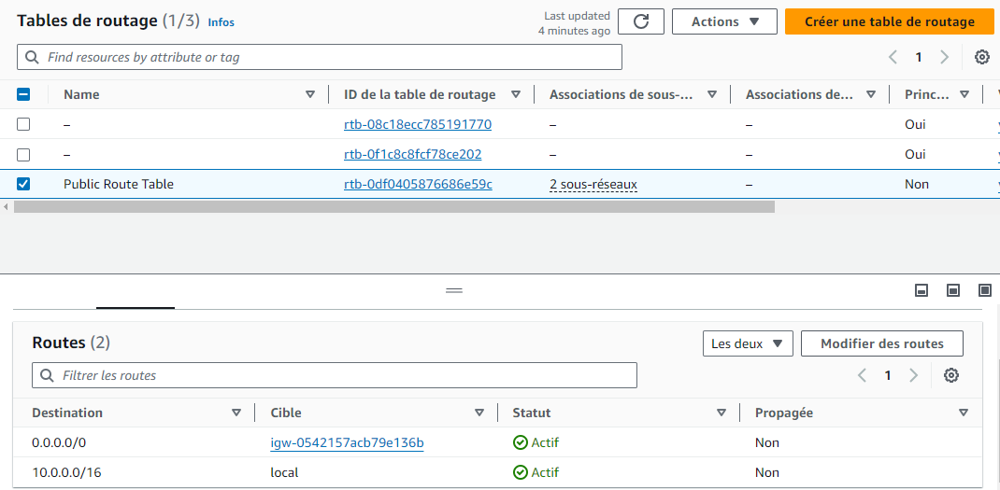
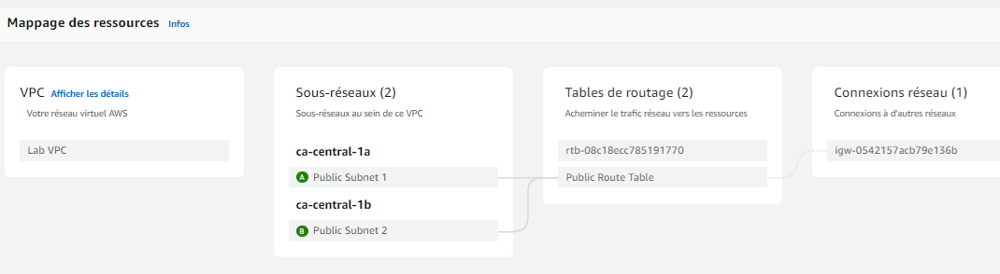
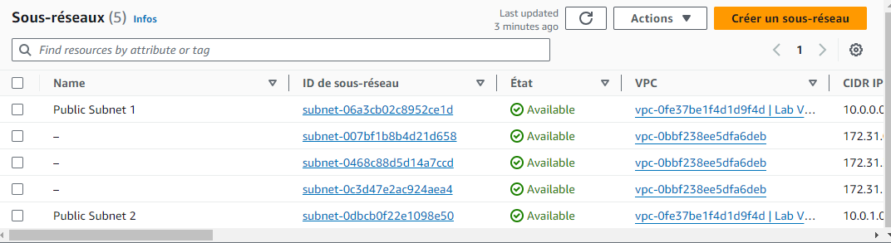
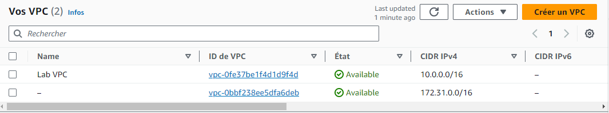
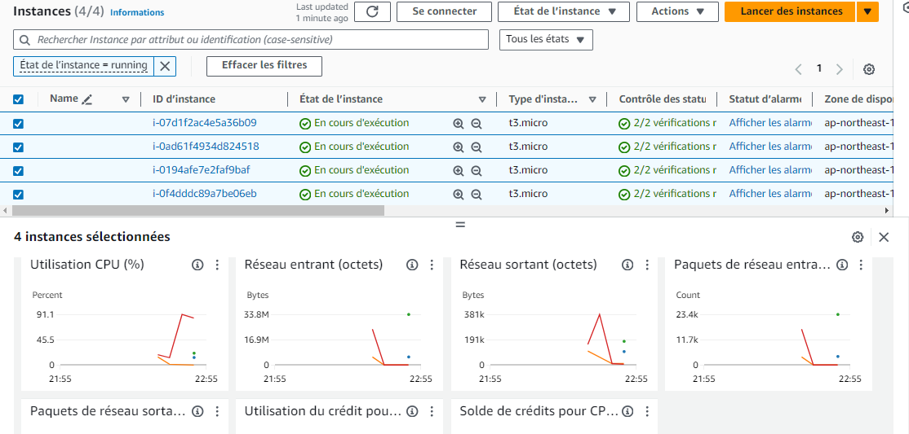
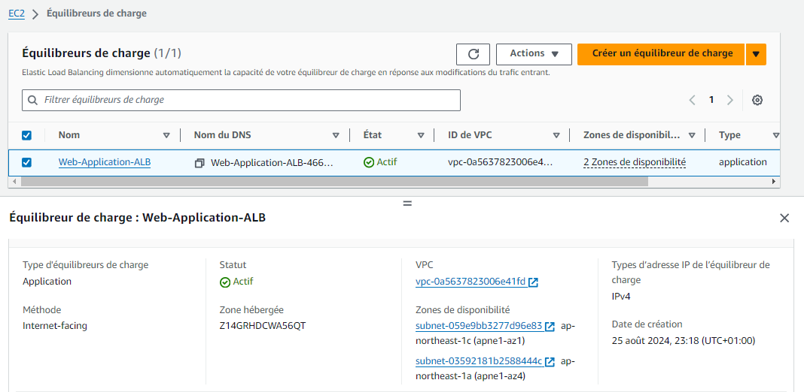
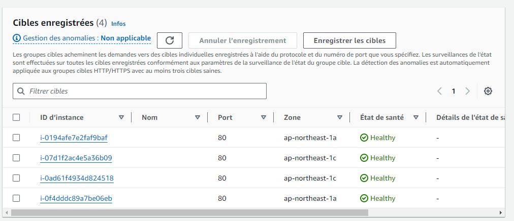

# 🚀 AWS solution architect Project

> Projet réalisé dans le cadre de la certification AWS Solution Architect. Ce projet illustre la mise en œuvre d'une architecture cloud complète, incluant VPC, EC2, Auto Scaling, Load Balancing, S3, DynamoDB, IAM, et CloudWatch.

---

## 🧩 Architecture Générale

Voici l'architecture globale du projet :

1. **VPC (Virtual Private Cloud)** :
   - Deux zones de disponibilité (`ca-central-1a` et `ca-central-1b`).
   - Deux sous-réseaux publics pour garantir la redondance et la haute disponibilité.

2. **Application Load Balancer (ALB)** :
   - Distribue la charge entre les instances EC2.
   - Assure la haute disponibilité en cas de panne d'une instance.

3. **Instances EC2** :
   - Deux instances EC2 déployées dans des zones de disponibilité différentes.
   - Gérées par un groupe Auto Scaling pour s'adapter à la demande.

4. **Auto Scaling Group** :
   - Ajoute ou supprime automatiquement des instances EC2 en fonction de la charge.

5. **Amazon DynamoDB** :
   - Table NoSQL utilisée pour stocker et récupérer des données rapidement.

6. **Amazon S3** :
   - Stockage objet utilisé pour conserver des fichiers ou des ressources statiques.

7. **IAM (Identity and Access Management)** :
   - Définit les politiques d'accès pour les instances EC2.

8. **Amazon CloudWatch** :
   - Surveille les métriques et les logs de l'infrastructure.

---

## 🖼️ Screenshots

### 1. Architecture Globale

> **Description** : Cette image montre l'architecture complète du projet, incluant VPC, EC2, Load Balancer, Auto Scaling, S3, DynamoDB, IAM, et CloudWatch.

### 2. Table de Routage (Routing Table)

> **Description** : Cette image montre la configuration de la table de routage (`Public Route Table`) associée aux sous-réseaux publics. Les routes suivantes sont définies :
> - Destination : `0.0.0.0/0` → Cible : Internet Gateway (`igw-0542157acb79e136b`)
> - Destination : `10.0.0.0/16` → Cible : Local
> 
> Cela garantit que les instances EC2 peuvent accéder à Internet et communiquer entre elles.

### 3. Mappage des Ressources du VPC

> **Description** : Cette image illustre le mappage des ressources du VPC :
> - **VPC** : `Lab VPC`
> - **Sous-réseaux** :
>   - `ca-central-1a` : `Public Subnet 1`
>   - `ca-central-1b` : `Public Subnet 2`
> - **Tables de Routage** : `Public Route Table` est associée aux deux sous-réseaux.
> - **Connexions réseau** : Une connexion à un Internet Gateway (`igw`) est configurée.

### 4. Liste des Sous-réseaux

> **Description** : Cette image montre la liste des sous-réseaux créés :
> - **Public Subnet 1** :
>   - ID : `subnet-06a3cb02c8952ce1d`
>   - CIDR : `10.0.0.0/24`
> - **Public Subnet 2** :
>   - ID : `subnet-0dbcb0f22e1098e50`
>   - CIDR : `10.0.1.0/24`
> 
> Chaque sous-réseau est disponible et associé au VPC `Lab VPC`.

### 5. Liste des VPC

> **Description** : Cette image montre la liste des VPC créés :
> - **Lab VPC** :
>   - ID : `vpc-0fe37be1f4d1d9f4d`
>   - CIDR IPv4 : `10.0.0.0/16`
> - **Autre VPC** :
>   - ID : `vpc-0bbf238ee5dfa6deb`
>   - CIDR IPv4 : `172.31.0.0/16`
> 
> Le VPC `Lab VPC` est utilisé pour ce projet.

### 6. Instances EC2

> **Description** : Cette image montre les instances EC2 en cours d'exécution :
> - **Nombre d'instances** : 4 instances EC2 (`t3.micro`).
> - **État** : Toutes les instances sont en état `En cours d'exécution`.
> - **Zone de disponibilité** :
>   - Deux instances dans `ap-northeast-1a`.
>   - Deux instances dans `ap-northeast-1c`.
> 
> Les métriques suivantes sont affichées :
> - Utilisation CPU (%).
> - Réseau entrant/sortant (octets).
> - Paquets de réseau entrants/sortants.
> 
> Ces instances sont gérées par un groupe Auto Scaling pour assurer une scalabilité dynamique.

### 7. Équilibrage de Charge (Load Balancer)

> **Description** : Cette image montre la configuration de l'Application Load Balancer (ALB) :
> - **Nom** : `Web-Application-ALB`
> - **Statut** : Actif
> - **Type d'équilibrage de charge** : Application Load Balancer (ALB)
> - **Méthode** : Internet-facing (exposé à Internet)
> - **VPC** : `vpc-0a5637823006e41fd`
> - **Zones de disponibilité** :
>   - `subnet-059e9bb3277d96e83` (ap-northeast-1c)
>   - `subnet-03592181b258844c` (ap-northeast-1a)
> 
> L'ALB distribue la charge entre les instances EC2 réparties dans différentes zones de disponibilité, garantissant une haute disponibilité et une distribution uniforme du trafic.

### 8. Employee Directory - Home

> **Description** : Cette image montre l'interface utilisateur de l'application `Employee Directory` :
> - **Titre** : `Employee Directory - Home`
> - **Message de succès** : Un message bleu indique que l'employé `'AKASBI Yasser'` a été ajouté avec succès.
> - **Tableau d'employés** :
>   - Colonnes : `Employee Name`, `Location`, `Email`, `Photo Available`.
>   - Actions disponibles : Une option `Actions` permet de gérer les employés (modifier, supprimer, etc.).
> 
> Cela illustre une application web qui interagit avec une base de données (DynamoDB) pour stocker et afficher les informations des employés.

### 9. Configuration de l'Application

> **Description** : Cette image montre la configuration de l'application :
> - **Dynamo DB Enabled** : Activé.
> - **S3 Access Enabled** : Activé.
> - **Bucket S3** : `labstack-6f95f3dd-1465-435e-9eb9-3e5c-imagesbucket-xyibfs44snrb`.
> - **Région** : `ap-northeast-1`.
> - **Zone de disponibilité** : `ap-northeast-1c`.
> - **ID d'instance EC2** : `i-0ad61f4934d824518`.
> - **Outils d'administration** :
>   - **CPU Usage** : L'utilisation CPU est affichée (1% actuellement).
>   - **Stress Testing** : Option pour tester la résistance de l'application en simulant une charge accrue.
> 
> Cela montre que l'application utilise :
> - DynamoDB comme base de données NoSQL.
> - S3 pour stocker les photos des employés.
> - Une instance EC2 spécifique pour héberger l'application.
> - Des outils d'administration pour surveiller l'utilisation CPU et effectuer des tests de charge.

### 10. Target Configuration

> **Description** : Cette image montre la configuration des cibles pour l'Application Load Balancer (ALB). Les cibles sont généralement des instances EC2 ou des services backend auxquels le load balancer redirige le trafic. La configuration inclut :
> - **Cibles** : Liste des instances EC2 ou autres ressources connectées.
> - **État** : Statut de chaque cible (en ligne, hors ligne, etc.).
> - **Poids** : Poids attribué à chaque cible pour la distribution du trafic.
> 
> Cela garantit que le trafic est correctement distribué vers les ressources appropriées.

---

## 🛠️ Technologies Utilisées

- **AWS Services** :
  - Amazon VPC
  - Amazon EC2
  - Auto Scaling
  - Application Load Balancer
  - Amazon S3
  - Amazon DynamoDB
  - IAM
  - Amazon CloudWatch

- **Autres Outils** :
  - AWS CLI
  - AWS Management Console

---

## 📦 Structure du Projet
