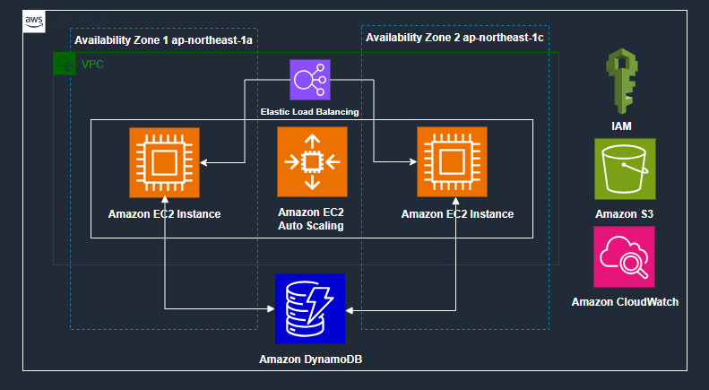
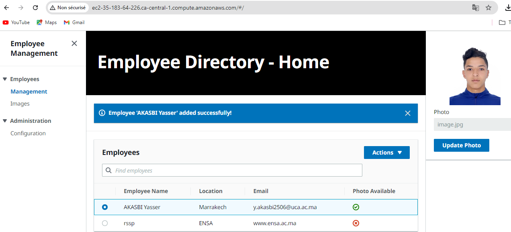
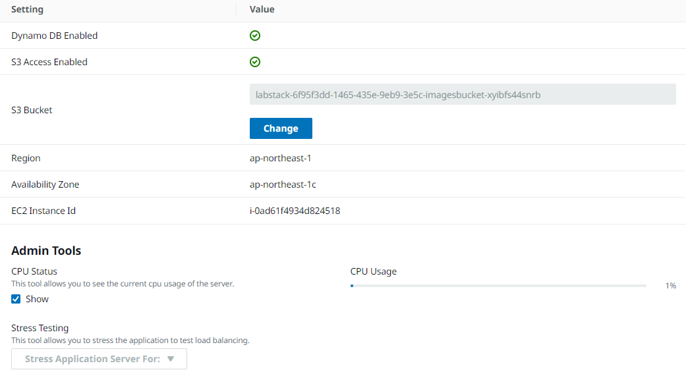

# 🚀 AWS Cloud Technical Essentials Project

> Projet réalisé dans le cadre de l'atelier AWS Cloud Technical Essentials. Ce projet illustre la mise en œuvre d'une architecture cloud complète, incluant VPC, EC2, Auto Scaling, Load Balancing, S3, DynamoDB, IAM, et CloudWatch.

---

## 🧩 Architecture Générale

Voici l'architecture globale du projet :

1. **VPC (Virtual Private Cloud)** :
   - Deux zones de disponibilité (`ca-central-1a` et `ca-central-1b`).
   - Deux sous-réseaux publics pour garantir la redondance et la haute disponibilité.

2. **Application Load Balancer (ALB)** :
   - Distribue la charge entre les instances EC2.
   - Assure la haute disponibilité en cas de panne d'une instance.

3. **Instances EC2** :
   - Deux instances EC2 déployées dans des zones de disponibilité différentes.
   - Gérées par un groupe Auto Scaling pour s'adapter à la demande.

4. **Auto Scaling Group** :
   - Ajoute ou supprime automatiquement des instances EC2 en fonction de la charge.

5. **Amazon DynamoDB** :
   - Table NoSQL utilisée pour stocker et récupérer des données rapidement.

6. **Amazon S3** :
   - Stockage objet utilisé pour conserver des fichiers ou des ressources statiques.

7. **IAM (Identity and Access Management)** :
   - Définit les politiques d'accès pour les instances EC2.

8. **Amazon CloudWatch** :
   - Surveille les métriques et les logs de l'infrastructure.

---

## 🖼️ Screenshots

### 1. Employee Directory - Home

> **Description** : Cette image montre l'interface utilisateur de l'application `Employee Directory` :
> - **Titre** : `Employee Directory - Home`
> - **Message de succès** : Un message bleu indique que l'employé `'AKASBI Yasser'` a été ajouté avec succès.
> - **Tableau d'employés** :
>   - Colonnes : `Employee Name`, `Location`, `Email`, `Photo Available`.
>   - Actions disponibles : Une option `Actions` permet de gérer les employés (modifier, supprimer, etc.).
> 
> Cela illustre une application web qui interagit avec une base de données (DynamoDB) pour stocker et afficher les informations des employés.

### 2. Configuration de l'Application

> **Description** : Cette image montre la configuration de l'application :
> - **Dynamo DB Enabled** : Activé.
> - **S3 Access Enabled** : Activé.
> - **Bucket S3** : `labstack-6f95f3dd-1465-435e-9eb9-3e5c-imagesbucket-xyibfs44snrb`.
> - **Région** : `ap-northeast-1`.
> - **Zone de disponibilité** : `ap-northeast-1c`.
> - **ID d'instance EC2** : `i-0ad61f4934d824518`.
> - **Outils d'administration** :
>   - **CPU Usage** : L'utilisation CPU est affichée (1% actuellement).
>   - **Stress Testing** : Option pour tester la résistance de l'application en simulant une charge accrue.
> 
> Cela montre que l'application utilise :
> - DynamoDB comme base de données NoSQL.
> - S3 pour stocker les photos des employés.
> - Une instance EC2 spécifique pour héberger l'application.
> - Des outils d'administration pour surveiller l'utilisation CPU et effectuer des tests de charge.

---

## 🛠️ Technologies Utilisées

- **AWS Services** :
  - Amazon VPC
  - Amazon EC2
  - Auto Scaling
  - Application Load Balancer
  - Amazon S3
  - Amazon DynamoDB
  - IAM
  - Amazon CloudWatch

- **Autres Outils** :
  - AWS CLI
  - AWS Management Console

---

## 📦 Structure du Projet
